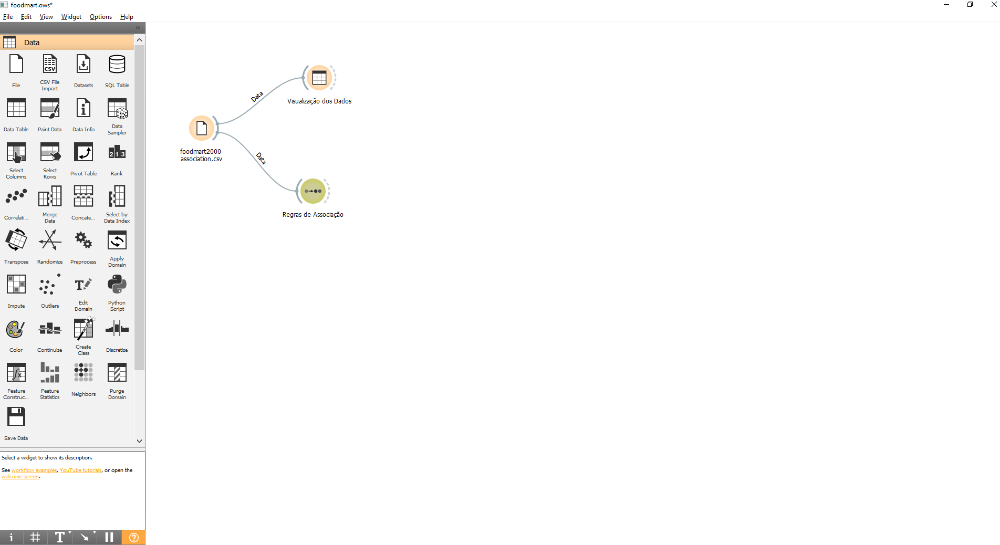
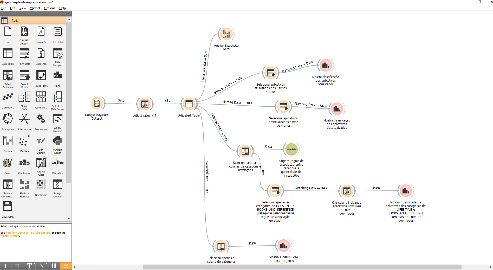
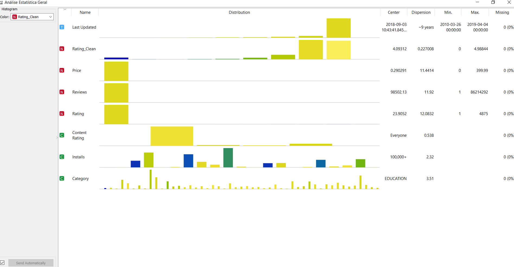
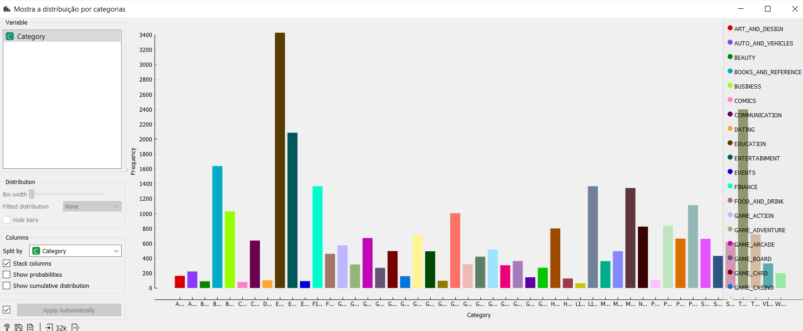
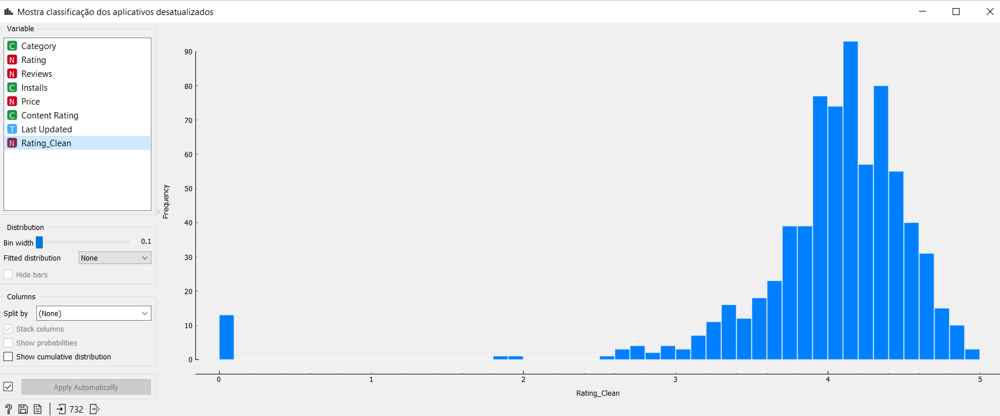
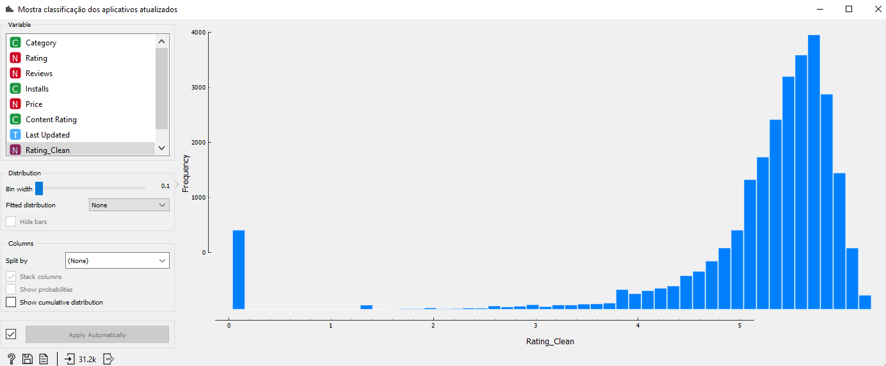
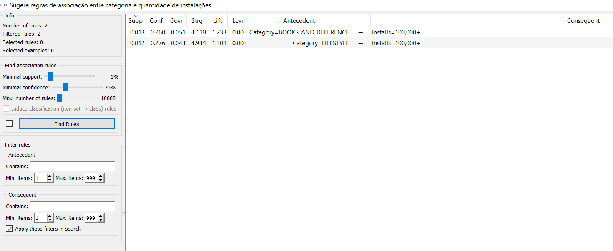
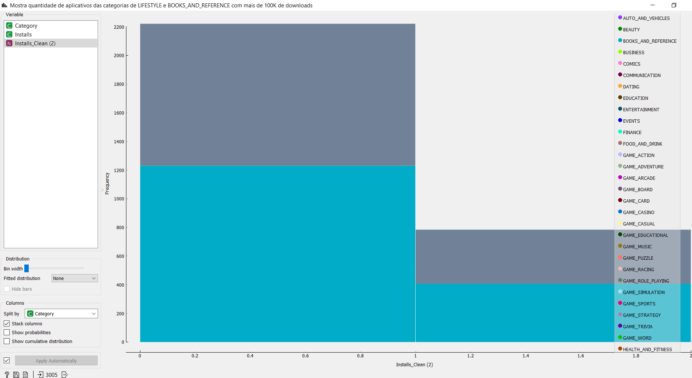

# Apresentação do Lab01 - Data Flow

Estrutura de pastas:

~~~
├── README.md  <- arquivo apresentando a tarefa
│
├── images     <- arquivos de imagens usadas no documento
│
└── orange     <- arquivos do Orange
~~~

# Projeto Orange / Regras de Associação para Foodmart

## Imagem do Projeto

## Arquivo do Projeto

[Projeto Orange - Regras de Associação Foodmart](orange/foodmart/foodmart.ows)

# Projeto Orange / Análise de Dados do Google PlayStore

## Imagem do Projeto

## Arquivo do Projeto

[Projeto Orange - Análise de Dados do Google PlayStore](orange/google-playstore/google-playstore-preparation.ows)

## Gráfico(s) de Análise

# Análise Estatística Geral

*Uma análise estatística geral do dados, utilizada para conhecer melhor a base e gerar insights para as outras análises*

# Distribuição de categorias

*Gráfico mostrando como os apps da base se distribuem dentro das categorias da Google Playstore*

# Atualização X Rating

*Gráfico mostrando a distribuição das classificações (ratings) para aplicativos desatualizados a mais de 4,5 anos (metade do tempo de vida da base, que é de 9 anos)*

*Gráfico mostrando a distribuição das classificações (ratings) para aplicativos atualizados nos últimos 4,5 anos (metade do tempo de vida da base, que é de 9 anos)*

Obs: com essa análise é possível notar que quando mais desatualizado, pior a média de classificação do aplicativo. Utilizamos somente dois recortes de dados nessa demonstração, mas foram feitos outros recortes temporais durante o desenvolvimento do trabalho e essa hipótese permaneceu.

# Categorias com mais porcentagem de instalação

*Utilizando a funcionalidade de regras de associação, foi sugerido que nas categorias LIFESTYLE e BOOK_AND_REFERENCE pelo menos 25% dos apps tem mais de 100 mil instalações*

*Gráfico mostrando que pelo menos 25% dos apps das categorias de LIFESTYLE e BOOK_AND_REFERENCE tem mais de 100 mil instalações. Os valores entre 0 e 1 no gráfico representam apps com menos de 100 downloads e os valores entre 1 e 2 representam apps com mais de 100 mil instalações.*

# Projeto de Composição de Componentes para Recomendação

> Imagem (`PNG`) do diagrama de componentes (veja exemplos abaixo).

# Projeto de Composição de Componentes para Pedido

## Diagrama de Componentes

> Imagem (`PNG`) do diagrama de componentes do pedido de um produto (veja exemplos abaixo).

## Diagrama de Interfaces

> Imagem (`PNG`) do detalhamento de interfaces referentes aos componentes.
