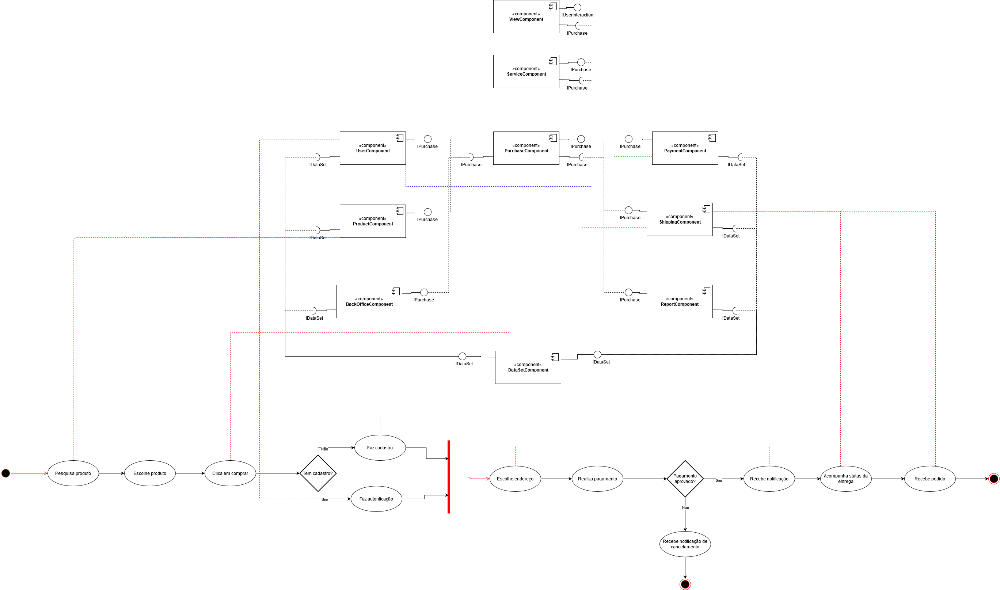
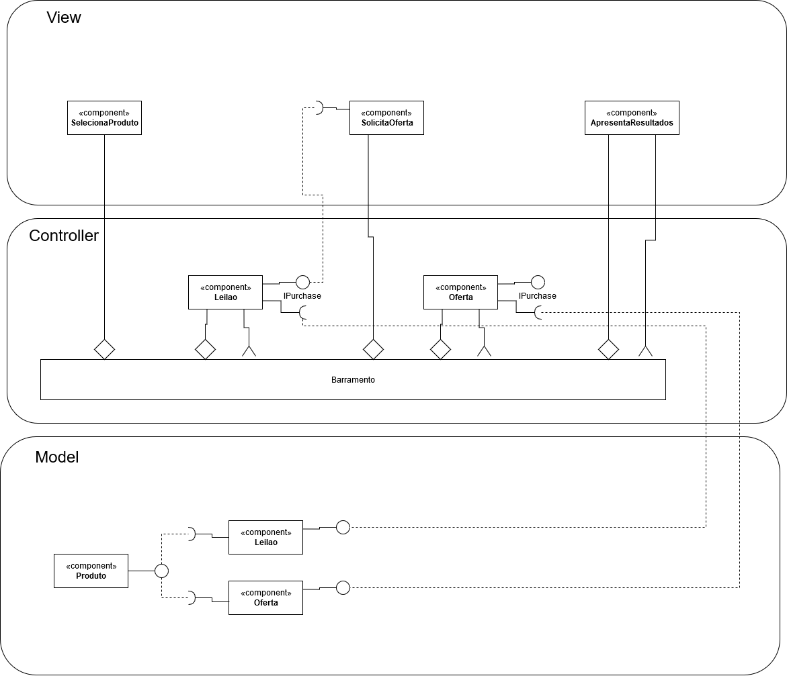
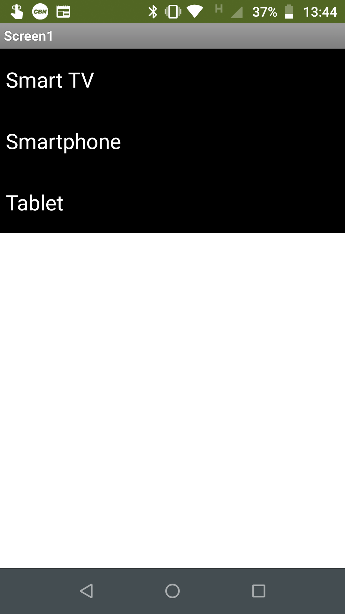
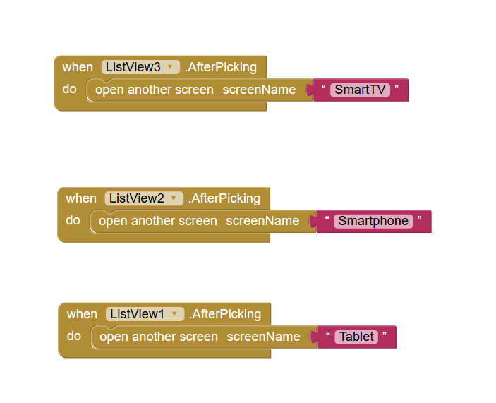
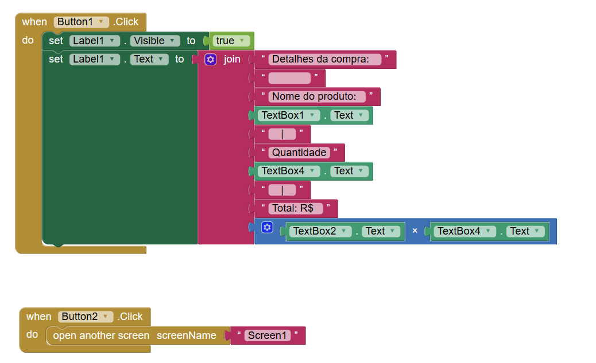
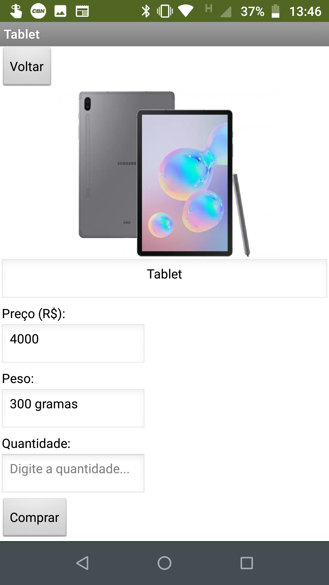
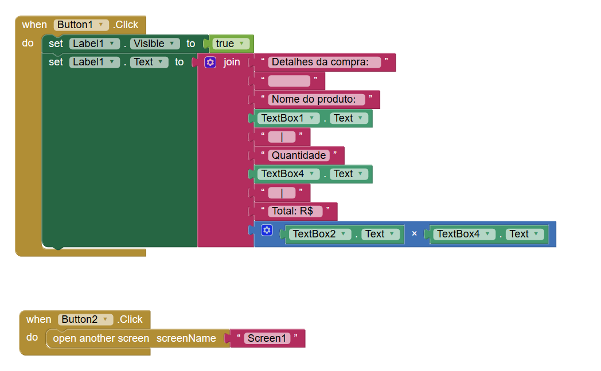
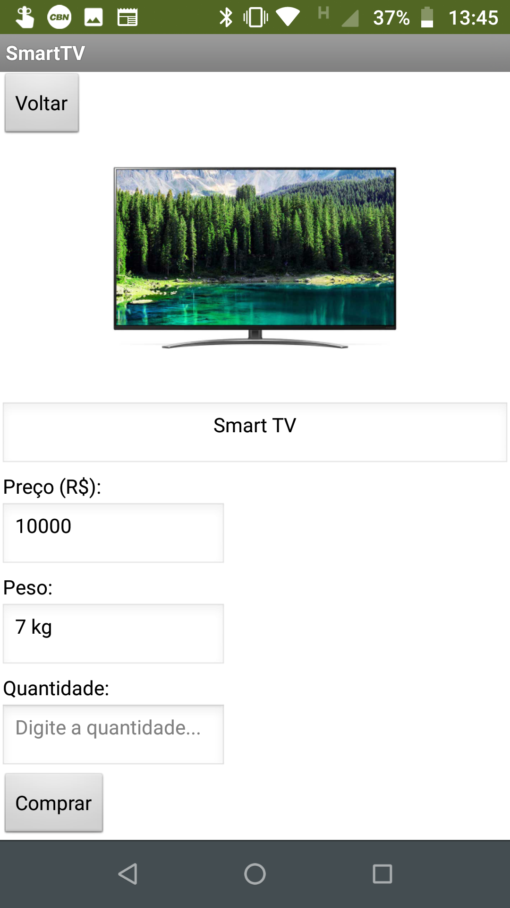
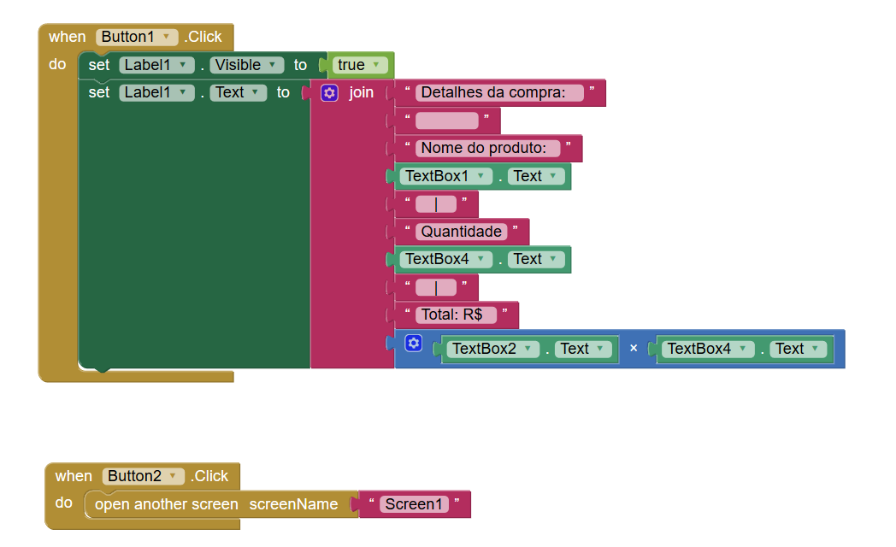
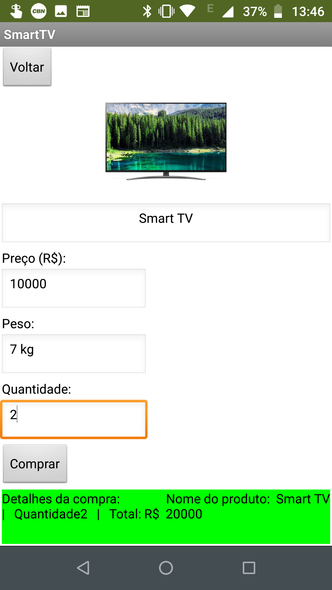

# Orquestração e Coreografia
*Lab de Componentização e Reúso de Software 15/08/2020*

Estrutura de pastas:

~~~
├── README.md  <- arquivo apresentando a tarefa
│
└── imagens   <- arquivos de imagem
~~~

## Tarefa 1

## Tarefa 2

## Tarefa 3

## Tarefa 3

Tela de listagem de produtos:

Diagrama de blocos da tela de listagem de produtos:

Tela do produto Smartphone:

Diagrama de blocos da tela do produto Smartphone:

Tela do produto Tablet:

Diagrama de blocos da tela do produto Tablet:

Tela do produto SmartTV:

Diagrama de blocos da tela do produto SmartTV:

Tela depois do clique no botão de "Comprar":

Projeto do MIT App Inventor:

[Projeto App Inventor](app/unicamp_inf331_lab3_tar3.aia)

## Tarefa 4

https://github.com/inf331equipe08/marketplace
