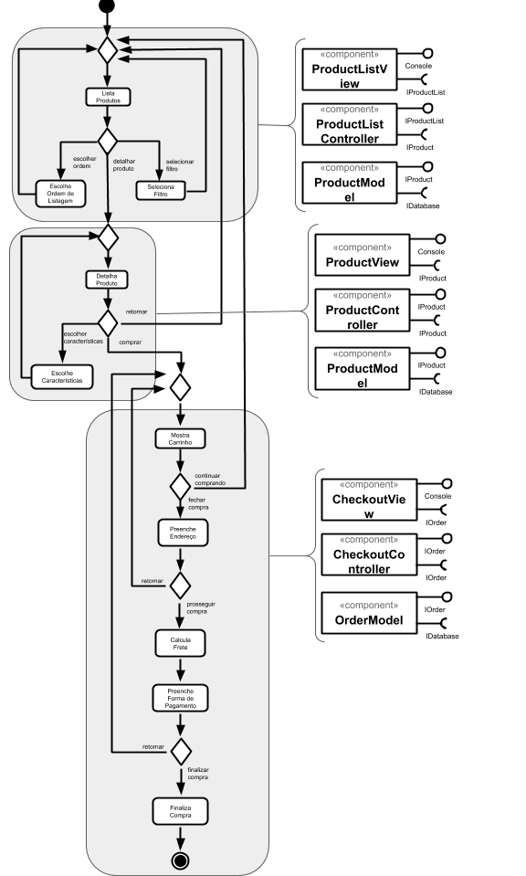

# Apresentação do Lab04 - Serviços

Estrutura de pastas:

~~~
├── README.md  <- arquivo apresentando a tarefa
│
└── images     <- arquivos de imagens usadas no documento
~~~

## Tarefa 1
> Coloque a imagem do PNG do seu diagrama como ilustrado abaixo:

## Tarefa 2
> Coloque a imagem do PNG do seu diagrama como ilustrado abaixo:

## Tarefa 3
> Coloque a imagem do PNG do seu diagrama como ilustrado abaixo:

## Tarefa 4

### Serviço `1`

### Serviço Exemplo

* **Título do serviço**: `Get Gnews`
* **Breve descrição**:
  Serviço que retorna as últimas notícias sobre o COVID-19 disponíveis o Google News API referentes aos Estados Unidos.
* **URL completa da requisição**: `https://covid19-us-api.herokuapp.com/news`
* **Cabeçalho HTTP da chamada**:
~~~http
GET /news HTTP/1.1
Host: https://covid19-us-api.herokuapp.com
~~~
* **Cabeçalho HTTP da resposta**:
~~~http
HTTP/1.1 200 OK
Connection: keep-alive
Date: Sat, 29 Aug 2020 02:10:38 GMT
Server: uvicorn
Content-Length: 5352
Content-Type: application/json
Via: 1.1 vegur
~~~
* **Conteúdo da resposta**:
~~~json
{
    "success": true,
    "message": [
        {
            "title": "Apple Loop: New iPhone 12 Leaks, iPad Pro Update Confirmed, Goodbye MacBook Pro - Forbes",
            "url": "https://www.forbes.com/sites/ewanspence/2020/08/28/apple-news-headlines-iphone-12-display-camera-macbook-pro-macos-ipad-apple-watch-fortnite-applebot/",
            "published": "Fri 28, 2020, 06: 28 PM ET"
        },
        {
            "title": "FULL REVEAL! Elon Musk's Neuralink chip tested live in pig brains - CNET",
            "url": "https://news.google.com/__i/rss/rd/articles/CBMiK2h0dHBzOi8vd3d3LnlvdXR1YmUuY29tL3dhdGNoP3Y9TnFiUXVaT0Z2T1HSAQA?oc=5",
            "published": "Fri 28, 2020, 06: 23 PM ET"
        },
        {
            "title": "Donald Trump says he wants the Big Ten and other conferences to start playing football 'now' - Yahoo Sports",
            "url": "https://sports.yahoo.com/donald-trump-says-he-wants-the-big-ten-and-other-conferences-to-start-playing-football-now-224251881.html",
            "published": "Fri 28, 2020, 05: 42 PM ET"
        }
    ]
}
~~~

### Serviço `2`

* **Título do serviço**: `Get Twitter`
* **Breve descrição**:
  Serviço que retorna os últimos tweets sobre COVID-19 nos Estados Unidos.
* **URL completa da requisição**: `https://covid19-us-api.herokuapp.com/twitter`
* **Cabeçalho HTTP da chamada**:
~~~http
GET /twitter HTTP/1.1
Host: https://covid19-us-api.herokuapp.com
~~~
* **Cabeçalho HTTP da resposta**:
~~~http
HTTP/1.1 200 OK
Connection: keep-alive
Date: Sat, 29 Aug 2020 02:14:21 GMT
Server: uvicorn
Content-Length: 466554
Content-Type: application/json
Via: 1.1 vegur
~~~
* **Conteúdo da resposta**:
~~~json
{
    "success": true,
    "message": {
        "username": "CDCgov",
        "full_name": "CDCgov",
        "tweets": [
            {
                "tweet_id": 1299485679722868739,
                "full_text": "RT @CDC_HIVAIDS: CDC's new guidance for #PrEP programs affected by #COVID19 discusses home specimen collection kits for #HIV and #STD testi…",
                "created_at": "2020-08-28T23:15:03"
            },
            {
                "tweet_id": 1299481983945449472,
                "full_text": "RT @CDC_NCEZID: Is your pet included in your family’s emergency plan? #PrepareNow by making a pet disaster kit:\n\n Food, water &amp; bowls\n Pe…",
                "created_at": "2020-08-28T23:00:22"
            },
            {
                "tweet_id": 1299476861861457925,
                "full_text": "RT @HHSGov: Cars can quickly heat up to dangerous temperatures, even with a window cracked open. Find more tips from @CDCgov for staying sa…",
                "created_at": "2020-08-28T22:40:01"
            }
        ]
    }
}
~~~

Obs: a quantidade de itens no retorno dos serviços foi reduzida para facilitar a leitura.
