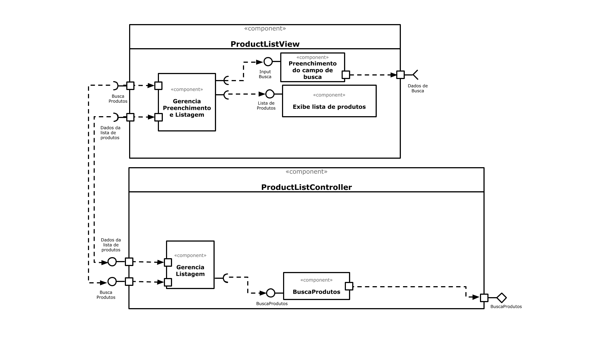

# Apresentação do Lab05 - Subcomponentes e Páginas Dinâmicas

Estrutura de pastas:

~~~
├── README.md  <- arquivo apresentando a tarefa
│
└── images     <- arquivos de imagens usadas no documento
~~~

## Tarefa 1
> Coloque a imagem do PNG do seu diagrama como ilustrado abaixo:

## Tarefa 2
Link para o projeto no Codepen: [React 03 - Componente Barra](https://codepen.io/erikjborges/pen/WNwXBQE)

> Coloque o código do seu componente:
>
**HTML**
~~~html

~~~

**JavaScript**
~~~javascript
class Barra extends React.Component {
  render() {
    let resultado = "";
    for (let b = 1; b <= this.props.tamanho; b++)
      resultado += "=";
    return resultado;
  }
}

class TextOne extends React.Component {
  render() {

    return <h2>O dinossauro</h2>;
  }
}

class TextTwo extends React.Component {
  render() {

    return <h2>saiu da lama.</h2>;
  }
}

const elemento = 

                   <TextOne />
                   <Barra tamanho="10"/>
                   <TextTwo />
                 

ReactDOM.render(elemento,
        document.getElementById("root"));

~~~
